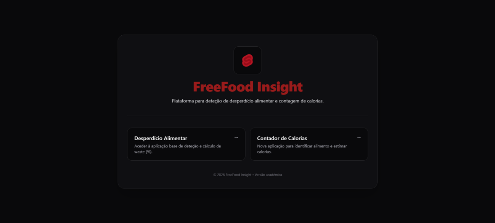
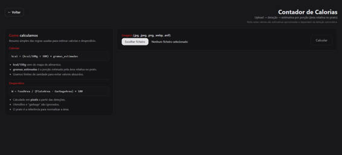
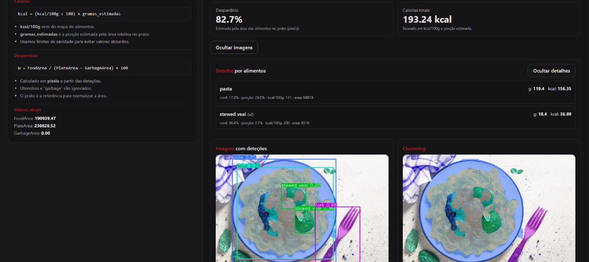
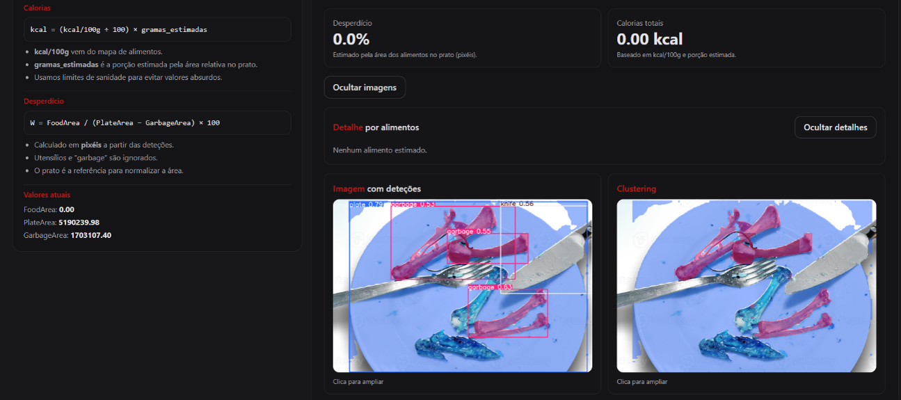

# FreeFood Insight — Food Waste + Calorie Estimation (YOLO)

FreeFood Insight is an academic project focused on **food waste detection** and **calorie estimation** using YOLOv11.

This repository is based on the open-source code associated with the article  
[Food Waste Detection in Canteen Plates using YOLOv11](https://www.mdpi.com/2076-3417/15/13/7137) (MDPI),  
by João Ferreira, Paulino Cerqueira and Jorge Ribeiro (IPVC).

As part of **Project III**, we extended the base project with a complete web interface (**FreeFood Insight**) and a new **calorie estimation module** integrated into the backend API.

---

## Main Features

### Food Waste Detection

The existing food waste module allows the user to upload an image of a plate and obtain:

- Detected objects and confidence values
- Food waste percentage
- Detection visualization
- Clustering visualization

Backend endpoint:

```http
POST /api/detect
```

### Calorie Estimation

A new calorie estimation workflow was added to the project.

The user can upload an image and obtain:

- Detected food items
- Estimated calories per item
- Total estimated calories

Backend endpoint:

```http
POST /api/calories
```

The calorie estimation workflow includes:

- Filtering of non-food objects such as plates, forks, knives and garbage
- Deduplication using IoU, with a fallback based on similar areas when bounding boxes are unavailable
- Aggregation of repeated food labels
- Minimum confidence and area validation
- Minimum and maximum portion limits
- Nutritional mapping using `calorie_map.json`

---

## What We Added

### Web Interface — FreeFood Insight

- Landing page and navigation
- Integration of the existing waste detection workflow
- New calorie estimation interface
- Image upload for calorie estimation
- Calories per detected item
- Total estimated calories

### Backend

- New `POST /api/calories` endpoint
- Filtering of non-food detections
- Duplicate detection handling
- Food label aggregation
- Portion and calorie estimation
- Integration with `calorie_map.json`

---

## Calorie Map Source

The `calorie_map.json` file was generated by mapping YOLO model labels to a public nutrition table:

https://raw.githubusercontent.com/EnriqManComp/Nutrition-Food-Insight-Analysis-Competition/master/nutrition.csv

Manual overrides were also applied to selected classes to avoid unrealistic values.

---

## Screenshots

### Food Waste Detection


### Waste Calculation


### FreeFood Insight Interface



### Calorie Estimation



### Calorie Estimation — Food Detected

Example of a processed image containing detected food items, estimated portions and total calories.



### Calorie Estimation — No Food Detected

Example of a processed image where only non-food objects and garbage were detected.



---

## Dataset

The dataset used in this project is publicly available on Roboflow:

https://universe.roboflow.com/project-eyfif/proj3-food-waste-detection

---

## Running the Project

### Requirements

- Docker
- Docker Compose
- YOLO model weights required by the backend

### Start

```bash
docker-compose up --build -d
```

### Stop

```bash
docker-compose down
```

---

## Project Origin

This project extends the open-source implementation associated with:

**Food Waste Detection in Canteen Plates using YOLOv11**

Research article:

https://www.mdpi.com/2076-3417/15/13/7137

The original food waste detection functionality was used as the base of the project.  
Our Project III work focused on extending it with the **FreeFood Insight web interface** and the **calorie estimation functionality**.
